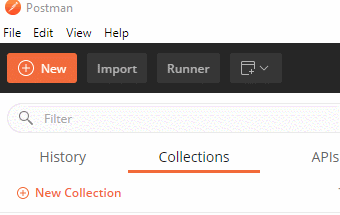
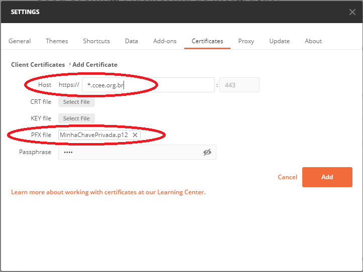

# Plataforma de Integração CCEE - Postman Collection

Conjunto de colections pré-configurados para serem rodados no [Postman](https://www.getpostman.com/) contém exemplos de chamadas dos serviços expostos pela [Plataforma de Integração CCEE](https://www.ccee.org.br/portal/faces/oquefazemos_menu_lateral/plataforma_integracao?_adf.ctrl-state=1cvbsj9eab_5).

Documentação do Postman Collection está disponível em https://documenter.getpostman.com/view/12351215/TVCdzTxD

# A Plataforma de Integração CCEE

A [Plataforma de Integração](https://www.ccee.org.br/portal/faces/oquefazemos_menu_lateral/plataforma_integracao?_adf.ctrl-state=ie2aj4g26_1&_afrLoop=94106078621418#!%40%40%3F_afrLoop%3D94106078621418%26_adf.ctrl-state%3Die2aj4g26_5) é uma ferramenta que conecta os sistemas dos agentes com os sistemas da CCEE.

A solução complementa os canais de acesso oferecidos pela CCEE para conectar o negócio do cliente de forma simples e acessar informações com rapidez, segurança e confiabilidade.

Entre os benefícios para os agentes que utilizam a plataforma estão:
- Redução de atividades manuais por meio da integração entre sistemas
- Menor custo e risco operacional com a automatização de rotinas
- Maior agilidade e qualidade na integração e no intercâmbio de dados entre CCEE e demais participantes do mercado

# Quem pode utilizar

Agentes e consultorias que tenham representação total dos seus clientes aderidos à CCEE.

# Como aderir

Para utilizar a solução, basta possuir um certificado digital e realizar um cadastro na CCEE. Veja como é simples:
1. [Adquira um certificado digital](https://www.iti.gov.br/index.php/icp-brasil/estrutura)
2. [Cadastre-se na Plataforma de Integração da CCEE](https://www.ccee.org.br/cs/idcplg?IdcService=GET_FILE&dDocName=CCEE_650001&RevisionSelectionMethod=LatestReleased&allowInterrupt=1&noSaveAs=1)

# Como utilizar

Com o certificado instalado e o cadastro realizado, o próximo passo é conectar seu sistema aos serviços da plataforma. Veja abaixo como utilizar cada um deles.

## Primeiros passos

- [Autenticação](https://www.ccee.org.br/cs/idcplg?IdcService=GET_FILE&dDocName=CCEE_316820&RevisionSelectionMethod=LatestReleased&allowInterrupt=1&noSaveAs=1)
- [Guia de contratos](https://www.ccee.org.br/cs/idcplg?IdcService=GET_FILE&dDocName=CCEE_650000&RevisionSelectionMethod=LatestReleased&allowInterrupt=1&noSaveAs=1)
- [Manual de uso dos serviços de acrônimos](https://www.ccee.org.br/cs/idcplg?IdcService=GET_FILE&dDocName=CCEE_654103&RevisionSelectionMethod=LatestReleased&allowInterrupt=1&noSaveAs=1)
- [Manual do usuário da plataforma de integração - Alertas e exceções](https://www.ccee.org.br/cs/idcplg?IdcService=GET_FILE&dDocName=CCEE_654104&RevisionSelectionMethod=LatestReleased&allowInterrupt=1&noSaveAs=1)
- [Manual de uso dos serviços de relatórios e resultados](https://www.ccee.org.br/cs/idcplg?IdcService=GET_FILE&dDocName=CCEE_655694&RevisionSelectionMethod=LatestReleased&allowInterrupt=1&noSaveAs=1)
- [Manual de uso dos serviços de PLD](https://www.ccee.org.br/cs/idcplg?IdcService=GET_FILE&dDocName=CCEE_656669&RevisionSelectionMethod=LatestReleased&allowInterrupt=1&noSaveAs=1)

## Configurar autenticação SSL mútua no Postman

Um dos requisitos para autenticação nos serviços da Plataforma de Integração é a autenticação SSL mútua. Isso quer dizer que, ao acessar os web services da CCEE, será necessário utilizar uma chave privada de um certificado previamente cadastrado na Plataforma de Integração.

Os passos abaixo mostram como configurar sua chave privada no Postman:

1. Verique se tem acesso à sua chave privada, em arquivo no formato *.PFX, *.P12, *.JKS ou similar

2. No Postman, acesse _File > Settings_

3. Adicione o arquivo com sua chave privada no campo _PFX File_, informando a senha do arquivo, e adicione o endereço o valor **_*.ccee.org.br_** no campo _Host_

### Referências

- [Postman Learning Center](https://learning.postman.com/)
- [Postman - Working with certificates](hhttps://learning.postman.com/docs/sending-requests/certificates/)

------
_Agredecimentos_

* [Diego Yosiura](https://www.linkedin.com/in/diegoyosiura/), por compartilhar a ideia original de criar um Postman Collection para os serviços da Plataforma de Integração, bem como compartilhar atualizações em seu arquivo.
